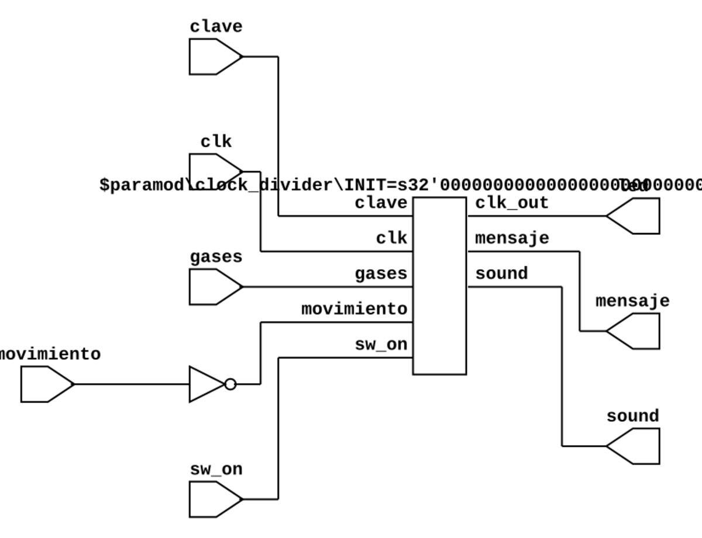

# Proyecto "Smart House"

## Introducción
El presente informe documenta el diseño, implementación y funcionamiento de un sistema de alarma en tiempo real utilizando una FPGA. Este proyecto fue desarrollado como parte de la materia de Electrónica Digital en la Universidad Nacional de Colombia.

El proyecto "Smart House" surge como respuesta a la creciente demanda de sistemas de seguridad eficientes y personalizables para el hogar. La combinación de una FPGA y diversos sensores permite crear un entorno inteligente y escalable capaz de detectar situaciones potencialmente peligrosas, como la presencia de movimiento o la existencia de gases nocivos. Este informe profundizará en los aspectos técnicos, los desafíos abordados y las decisiones de diseño que respaldan el desarrollo del sistema. "Smart House" se presenta como un proyecto en evolución constante. Las contribuciones de la comunidad son esenciales para enriquecer el sistema y abordar futuras mejoras. Se alienta a otros desarrolladores a participar en el desarrollo continuo del proyecto.

## Descripción del Problema

La seguridad residencial es un aspecto fundamental en la vida moderna, y tradicionalmente se ha abordado mediante sistemas propietarios y costosos. Este proyecto busca superar estas limitaciones, proporcionando un sistema de seguridad inteligente, asequible y personalizable. La detección temprana de eventos como movimiento y gas permite tomar medidas inmediatas para garantizar la seguridad del hogar y sus ocupantes.

## Objetivos
El objetivo primordial del proyecto "Smart House" es lograr la implementación exitosa de un sistema de seguridad innovador y adaptable para entornos residenciales. Este objetivo se desglosa en metas específicas destinadas a garantizar un sistema robusto y eficiente que aborde las necesidades de seguridad del hogar de manera efectiva.

### Detección de Movimiento

La implementación de un sensor de movimiento (PIR) es esencial para identificar la presencia de personas en áreas específicas de la casa. Esto se logra mediante el análisis de las señales generadas por el sensor y su interpretación por la FPGA. Con base a estas señales, se determinará si se debe alertar o no al usuario.

### Detección de Gas

El uso de un sensor de gas agrega una capa adicional de seguridad al sistema, permitiendo la identificación de posibles fugas o concentraciones peligrosas. La FPGA procesa las lecturas del sensor y activa las medidas correspondientes en caso de detección de gas.

### Notificación por Telegram

La integración de un bot de Telegram permite al sistema comunicarse directamente con el usuario. Se enviarán notificaciones inmediatas en caso de eventos adversos, brindando al usuario la capacidad de tomar decisiones informadas rápidamente.

### Alarma Sonora

La activación de un altavoz para generar una alarma sonora refuerza la capacidad de respuesta del sistema. Esta función añade una alerta audible que puede ser crucial en situaciones críticas.

## Arquitectura del Sistema

### FPGA

La FPGA actúa como el núcleo o cerebro del sistema, coordinando todas las operaciones. Su capacidad de programación flexible permite adaptarse a diversas configuraciones y requisitos del proyecto. La FPGA determina el flujo de acciones según las señales de entrada y se comunicará constantemente con el servidor alojado en el microcontrolador ESP32
A continuación, se muestra el RTL de la capa principal a modo de ilustración de la arquitectura.

La salida llamada "mensaje" es la encargada de comunicar los datos adquiridos por la FPGA en el servidor remoto alojado en la ESP32.

### Sensor de Movimiento y Sensor de Gas

La correcta conexión y calibración de estos sensores son esenciales para garantizar una detección precisa. Las señales analógicas se convierten digitalmente y son procesadas por la FPGA para su interpretación.

### Bot de Telegram

La configuración del bot implica la obtención de un token para la comunicación segura. La integración del bot con la FPGA se realiza mediante una interfaz de programación de aplicaciones (API) de Telegram. Un microcontrolador ESP32 garantiza la comunicación entre la FPGA y el usuario mediante un bot de telegram alojado en dicho microcontrolador.

### Altavoz

La activación del altavoz se realiza en respuesta a eventos detectados, proporcionando una alerta audible en caso de emergencia.

## Instrucciones de Uso

### Conexión de Sensores y funcionamiento de la FPGA

Es crucial seguir las instrucciones de conexión de los sensores a la FPGA para garantizar un funcionamiento adecuado del sistema.

# Simulaciones

Este repositorio incluye simulaciones del módulo `top`, el cual es un componente principal  del sistema. Las simulaciones se han diseñado para verificar el comportamiento del módulo bajo diversas condiciones y escenarios.

## Descripción del Módulo

El módulo `top` está diseñado para gestionar diversas entradas, como señales de reloj, interruptores, sensores de gases, movimientos y claves, y produce salidas correspondientes, incluidos LEDs, sonidos y mensajes.

## Simulaciones Realizadas

1. **Activación de Gases:**
   - Escenario: Se activa la señal de gases.
   - Objetivo: Verificar la respuesta del módulo ante la activación de gases.

2. **Detección de Movimiento y Desactivación de Clave:**
   - Escenario: Se detecta movimiento y se desactiva la clave.
   - Objetivo: Confirmar el correcto funcionamiento del módulo en condiciones de movimiento y clave desactivada.

3. **Cambio de Clave y Desactivación de Gases:**
   - Escenario: Se cambia la clave y se desactiva la señal de gases.
   - Objetivo: Evaluar la respuesta del módulo a cambios en la clave y la señal de gases.

4. **Activación del Interruptor General:**
   - Escenario: Se activa el interruptor general.
   - Objetivo: Comprobar el comportamiento del módulo al activar el interruptor general.

5. **Condiciones Combinadas:**
   - Escenario: Se activan simultáneamente el interruptor general, la señal de gases, el movimiento y se desactiva la clave.
   - Objetivo: Verificar la capacidad del módulo para gestionar múltiples condiciones concurrentes.

## Ejecución de las Simulaciones

Para ejecutar las simulaciones, se automatiza el proceso con el makefile estudiado durante el curso
A continuación se muestran los resultados de las simulaciones. 

### Compilación y Carga

La compilación del código fuente y la carga del programa en la FPGA se realiza utilizando las herramientas open source proporcionadas durante el curso. La elección de utilizar herramientas open source durante el desarrollo y la implementación del proyecto refuerza la accesibilidad y transparencia del sistema. Esta decisión permite a la comunidad de desarrolladores comprender y mejorar el sistema de manera colaborativa.

### Monitoreo y control

El usuario puede monitorear las notificaciones del bot de Telegram para recibir alertas en tiempo real sobre eventos detectados. Además, la activación del altavoz proporciona una señal sonora adicional. Mediante este mismo bot, el usuarió podra desactivar la alarma en caso de ser necesario.
## Conclusiones

El proyecto ha logrado cumplir con los objetivos establecidos, proporcionando un sistema funcional y robusto de alarma utilizando una FPGA. La combinación de la detección de movimiento, la interacción con un bot de telegram, la generación de sonido en conjunto a una monitorización constante y en tiempo real, ofrece una solución completa para la aplicación propuesta.

## Mejoras Futuras

1. Incorporar más características de seguridad.
2. Mejorar la interfaz de usuario del teclado matricial.
3. Optimizar el consumo de energía del sistema.

